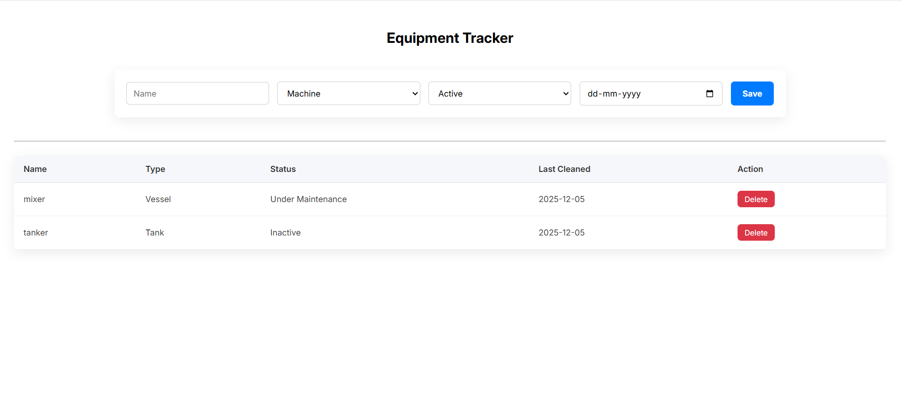

# Equipment Tracker

A simple MERN stack application to manage equipment. Users can view, add, edit, and delete equipment items.

## Features

* View equipment list in a table
* Add new equipment
* Edit existing equipment
* Delete equipment
* Each equipment has:

  * Name
  * Type (Machine, Vessel, Tank, Mixer)
  * Status (Active, Inactive, Under Maintenance)
  * Last Cleaned Date

## Tech Stack

* **Frontend:** React.js, HTML, CSS
* **Backend:** Node.js, Express.js
* **Database:** MongoDB 

## How to Run Locally

### 1. Clone the repository

```bash
git clone <your-repo-url>
cd equipment-tracker
```

### 2. Backend Setup

```bash
cd backend
npm install
```

* Create a `.env` file in the backend folder:

```
MONGO_URI=<your-mongodb-connection-string>
PORT=6000
```

* Start the backend:

```bash
npm run dev
```

The backend will run at `http://localhost:6000`.

### 3. Frontend Setup

```bash
cd frontend
npm install
```

* Update `API_URL` in `frontend/src/services/api.js` to match your backend:

```js
const API_URL = "http://localhost:6000/api/equipment";
```

* Start the frontend:

```bash
npm start
```

The frontend will run at `http://localhost:3000`.

## Assumptions

* All fields (`name`, `type`, `status`, `lastCleanedDate`) are required.
* No user authentication is needed.
* Data is small, so a simple MongoDB collection is sufficient.

## Possible Improvements (if more time was available)

* Add **user authentication/login**
* Add **search, filter, and sorting** on equipment list
* Add **pagination** for large data
* Improve **UI/UX design** with responsive layout
* Add **unit tests** for backend and frontend
* Handle **server errors gracefully** with notifications
* Deploy frontend and backend to **live URLs**

## Screenshot of Webpage


---
